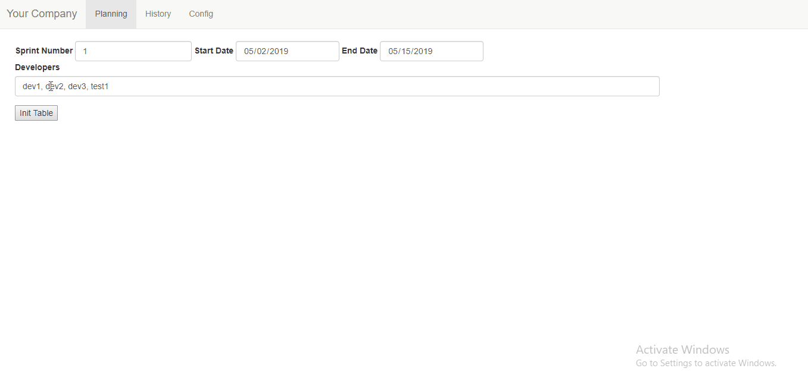

## Agile Scrum planning tool
  Simple and configurable tool used for planning allocation of next Scrum planning. 
### Technologies:
  - Angular 1.4
  - SpringBoot
  - Mongo DB
  
### Running the project
  - install MongoDb and add bin folder to your PATH variable
  ```shell
  mongoimport --db planning --collection configurations --file configurations.json --jsonArray
  mvn clean package
  java -jar target/planningApp-1.1.jar
  ```
 ## GIF
 
